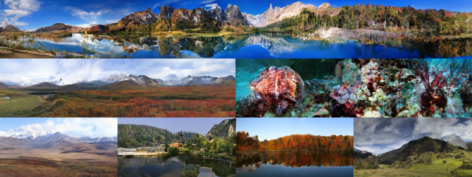

# An equivariant image modeling framework <br><sub></sub>

[](https://huggingface.co/UmiSonoda16/EquivariantModeling)&nbsp;

<p align="center">
  
</p>

This is an official PyTorch/GPU implementation of the paper ”An equivariant image modeling framework“

## ⚡️ Introduction
We propose a novel equivariant image modeling framework that inherently aligns optimization targets across subtasks in autoregressive image modeling by leveraging the translation invariance of natural visual signals. Our method introduces:
* Column-wise tokenization which enhances translational symmetry along the horizontal axis.
* Autoregressive generative models using windowed causal attention which enforces consistent contextual relationships across positions.

Evaluated on class-conditioned ImageNet generation at 256×256 resolution, our approach achieves performance comparable to state-of-the-art AR models while using fewer computational resources. Moreover, our approach significantly improving zero-shot generalization and enabling ultra-long image synthesis. 

This repo contains:

* 🪐 A simple PyTorch implementation of our [equivariant 1D tokenizer](tokenizer/models/tokenizer.py) and [equivariant generator](generator/equ_modeling.py).
* 💥 Pre-trained equivariant tokenizer trained on the ImageNet-1k dataset together with class-conditional equivariant generative model trained on the selected Places dataset (30 labels).
* 🛸 The training scripts of [equivariant 1D tokenizer](scripts/train_tokenizer.py) using PyTorch-Lightning and [equivariant generator](scripts/train_generator.py) utilizing PyTorch DDP.
* 🦄 The evaluation script of [equivariant generator](scripts/eval_generator.py) which samples high-fidelity images.
* 🎉 A self-contained [jupyter notebook]() for checking out the visual meanings of 1D tokens.


## 🌿 Preparation

### Dataset
Download the [ImageNet-1k](http://image-net.org/download) dataset following [Latent-Diffusion](https://github.com/CompVis/latent-diffusion), and place it in your `IMAGENET_PATH`.
<details>
    <summary> Assume the ImageNet is in `IMAGENET_PATH`. It should be like this:</summary>

    IMAGENET_PATH/autoencoders/data/:
        ILSVRC2012_train/data/:
            n01440764: 
                many_images.JPEG ...
            n01443537:
                many_images.JPEG ...
        ILSVRC2012_validation/data/:
            n01440764:
                ILSVRC2012_val_00000293.JPEG ...
            n01443537:
                ILSVRC2012_val_00000236.JPEG ...
</details>

Download the [Places-challenge](http://places2.csail.mit.edu/download.html) dataset, and place it in your `PLACES_PATH`.
   
### Installation

Download the code:
```
git clone git@github.com:drx-code/EquivariantModeling.git
cd EquivariantModeling
```

A suitable [conda](https://conda.io/) environment named `equivariant` can be created and activated with:

```
conda env create -f environment.yaml
conda activate equivariant
```

Our pre-trained tokenizer and generative models can be downloaded directly here: 

## ✨ Model Training 

### Tokenizer Training
Example configs for training the tokenizer has been provided at [first_stage_config](configs/first_stage/tokenizer_config.yaml).

First, pass your ImageNet dataset path `IMAGENET_PATH` to the `cached_dir` term in the config file.

Script for training our equivariant 1D tokenizer with the ImageNet dataset:
```
torchrun --nproc_per_node=8 --nnodes=${NUM_NODES} --node_rank=${NODE_RANK} --master_addr=${MASTER_ADDR} \
scripts/train_tokenizer.py \
-t True -nodes ${NODE_RANK} -ngpu 8 \
-b configs/first_stage/tokenizer_config.yaml
```
Logs and checkpoints for trained models are saved to `logs/<START_DATE_AND_TIME>_<config_spec>`.

* To fine-tune the decoder which enhances the reconstruction ability, replace the `configs/first_stage/tokenizer_config.yaml` with `configs/first_stage/tokenizer_config_stage2.yaml`.

### Generator Training
The training of our equivariant generators with the ImageNet can be started by running 
* Our small geneator
```
torchrun --nproc_per_node=8 --nnodes=${NUM_NODES} --node_rank=${NODE_RANK} --master_addr=${MASTER_ADDR} \
    train_generator.py \
    --model small_model --vae_embed_dim 256 --token_num 16 --num_iter 16 \
    --diffloss_d 12 --diffloss_w 960 --cond_length 3 \
    --epochs 1200 --warmup_epochs 100 --batch_size 64 --blr 1.0e-4 --float32\
    --diffusion_batch_mul 4 --buffer_size 16 --vae_norm 0.05493 \ 
    --config_path configs/second_stage/tokenizer_config.yaml\
    --output_dir ${SAVE_PATH}  --resume ${RESUME_PATH} --ckpt ${CKPT_PATH}\
    --data_path ${IMAGENET_PATH}/autoencoders/data/ILSVRC2012_train/data/
```

* Our base geneator
```
torchrun --nproc_per_node=8 --nnodes=${NUM_NODES} --node_rank=${NODE_RANK} --master_addr=${MASTER_ADDR} \
    train_generator.py \
    --model base_model --vae_embed_dim 256 --token_num 16 --num_iter 16 \
    --diffloss_d 12 --diffloss_w 1024 --cond_length 3 \
    --epochs 1200 --warmup_epochs 100 --batch_size 64 --blr 1.0e-4 --float32\
    --diffusion_batch_mul 4 --buffer_size 16 --vae_norm 0.05493 \ 
    --config_path configs/second_stage/tokenizer_config.yaml\
    --output_dir ${SAVE_PATH} --resume ${RESUME_PATH} --ckpt ${CKPT_PATH} \
    --data_path ${IMAGENET_PATH}/autoencoders/data/ILSVRC2012_train/data/
```

* Our large geneator
```
torchrun --nproc_per_node=8 --nnodes=${NUM_NODES} --node_rank=${NODE_RANK} --master_addr=${MASTER_ADDR} \
    train_generator.py \
    --model large_model --vae_embed_dim 256 --token_num 16 --num_iter 16 \
    --diffloss_d 12 --diffloss_w 1280 --cond_length 3 \
    --epochs 1200 --warmup_epochs 100 --batch_size 64 --blr 1.0e-4 --float32\
    --diffusion_batch_mul 4 --buffer_size 16 --vae_norm 0.05493 \ 
    --config_path configs/second_stage/tokenizer_config.yaml\
    --output_dir ${SAVE_PATH} --resume ${RESUME_PATH} --ckpt ${CKPT_PATH} \
    --data_path ${IMAGENET_PATH}/autoencoders/data/ILSVRC2012_train/data/
```

* Our huge geneator
```
torchrun --nproc_per_node=8 --nnodes=${NUM_NODES} --node_rank=${NODE_RANK} --master_addr=${MASTER_ADDR} \
    train_generator.py \
    --model huge_model --vae_embed_dim 256 --token_num 16 --num_iter 16 \
    --diffloss_d 12 --diffloss_w 1536 --cond_length 3 \
    --epochs 1200 --warmup_epochs 100 --batch_size 64 --blr 1.0e-4 --float32\
    --diffusion_batch_mul 4 --buffer_size 16 --vae_norm 0.05493 \ 
    --config_path configs/second_stage/tokenizer_config.yaml\
    --output_dir ${SAVE_PATH} --resume ${RESUME_PATH} --ckpt ${CKPT_PATH} \
    --data_path ${IMAGENET_PATH}/autoencoders/data/ILSVRC2012_train/data/
```
The training of our equivariant generator with filtered Places dataset (30 labels) can be started by running
```
torchrun --nproc_per_node=8 --nnodes=${NUM_NODES} --node_rank=${NODE_RANK} --master_addr=${MASTER_ADDR} \
    train_generator.py \
    --model large_model --vae_embed_dim 256 --token_num 16 --num_iter 16 \
    --diffloss_d 12 --diffloss_w 1280 --cond_length 3 --class_num 30\
    --epochs 1200 --warmup_epochs 100 --batch_size 64 --blr 1.0e-4 --float32\
    --diffusion_batch_mul 4 --buffer_size 16 --vae_norm 0.05493 \ 
    --config_path configs/second_stage/tokenizer_config.yaml \
    --output_dir ${SAVE_PATH} --resume ${RESUME_PATH} --ckpt ${CKPT_PATH} \
    --data_path ${PLACES_PATH}
```

* (Optional) To save GPU memory during training by reducing the parameters precision, remove --float32 in the arguments. Note that this may significantly harm the training stability.

* (Optional) To save GPU memory during training by using gradient checkpointing, add --grad_checkpointing to the arguments. Note that this may slightly reduce training speed.

## ⛅ Evaluation & Sampling 
### ImageNet-1k 256x256

Evaluate our geneative model trained on the ImageNet dataset with classifier-free guidance:
```
torchrun --nproc_per_node=8 --nnodes=1 --master_addr=${MASTER_ADDR} \
    eval_generator.py \
    --model huge_model --vae_embed_dim 256 --token_num 16 --num_iter 16 \
    --diffloss_d 12 --diffloss_w 1536 --cond_length 3 \
    --eval_bsz 64 --float32\
    --diffusion_batch_mul 4 --buffer_size 16 --vae_norm 0.05493 \ 
    --config_path configs/second_stage/tokenizer_config.yaml\
    --output_dir ${SAVE_PATH} --resume ${RESUME_PATH} --ckpt ${CKPT_PATH} \
    --num_images 50000 --cfg 7.0 \
```

* (Optional) To calculate the Frechet Inception Distance (gFID) and the Inception Score (IS) metrics, add --metrics to the arguments.
* Set --cfg 1.0 to evaluate without classifier-free guidance.

### Places: Long-content Images
Sampling long images with a length of `LENGTH` using the generative model trained on the Places with classifier-free guidance:
```
torchrun --nproc_per_node=8 --nnodes=1 --master_addr=${MASTER_ADDR} \
    eval_generator.py \
    --model large_model --vae_embed_dim 256 --token_num ${LENGTH} --num_iter ${LENGTH} \
    --diffloss_d 12 --diffloss_w 1024 --cond_length 3 --class_num 30\
    --eval_bsz 64 --float32\
    --diffusion_batch_mul 4 --buffer_size 16 --vae_norm 0.05493 \ 
    --config_path configs/second_stage/tokenizer_config.yaml\
    --output_dir ${SAVE_PATH} --resume ${RESUME_PATH} --ckpt ${CKPT_PATH} \
    --num_images 3000 --cfg 7.0 \
```

* To sample images with pre-trained generative model, set `RESUME_PATH` with `pretrained_models` and `CKPT_PATH` with `places_large.ckpt`. Moreover, fix the random seed to `1` if you want to reproduce the images shown in our paper.


## Acknowledgements

The code in this repo is mainly based on [Taming-Transformers](https://github.com/CompVis/taming-transformers), [Latent-Diffusion](https://github.com/CompVis/latent-diffusion), and [MAR](https://github.com/LTH14/mar).

## License
This repository is licensed under the MIT License - see the [LICENSE](LICENSE) file for details.

## Contact

If you have any questions, please contact us through email (dongruixiaoyx@mail.ustc.edu.cn).